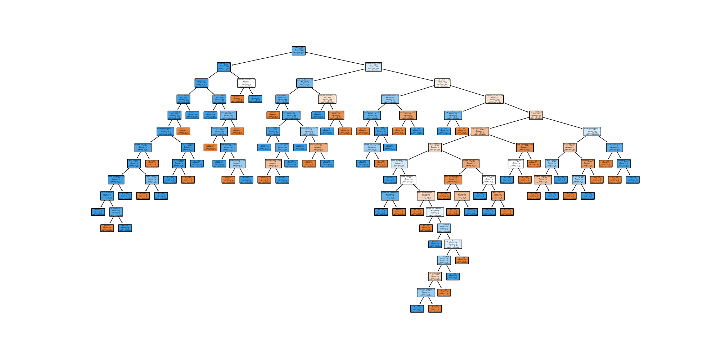

# Relatório Árvore de Decisão

Tags: Done
Atividades: Projeto Árvore de decisão (https://www.notion.so/Projeto-rvore-de-decis-o-7011c1609211411db71fd3b461e38c9f?pvs=21)

# 1. Breve descrição da técnica

A técnica utilizada neste experimento é a Árvore de Decisão, um algoritmo de aprendizado de máquina supervisionado usado para classificação e regressão. Ele cria uma árvore de decisão hierárquica onde cada nó interno representa uma decisão com base em um atributo específico, e cada folha representa a classe de saída.

# 2. Base de dados e Normalização:

A base de dados utilizada é o 'breast-cancer-wisconsin.data.txt', que contém informações sobre características de células de câncer de mama e sua mitose. Para normalizar a base, foi necessário substituir os valores ausentes representados por '?' pelo valor -99999, e transformar a variável de destino 'mitoses' em uma tarefa de classificação binária, onde 1 indica a presença de mitoses e 0 indica a ausência.

# 3.Desenvolvimento

### Importação de bibliotecas:

```python
import pandas as pd
from sklearn.model_selection import train_test_split
from sklearn.tree import DecisionTreeClassifier, plot_tree
from sklearn.neighbors import KNeighborsClassifier
from sklearn.metrics import accuracy_score, confusion_matrix, classification_report
import matplotlib.pyplot as plt
```

As bibliotecas necessárias para o código são importadas. O Pandas é importado como 'pd', e as bibliotecas do Scikit-learn para modelos de classificação (DecisionTreeClassifier e KNeighborsClassifier) e para avaliação de métricas (accuracy_score, confusion_matrix, classification_report) são importadas. A biblioteca Matplotlib também é importada para plotar gráficos.

### Leitura do conjunto de dados e substituição de valores ausentes:

```python
df = pd.read_csv('breast-cancer-wisconsin.data.txt')
df.replace('?', -99999, inplace=True)
```

O conjunto de dados é lido usando o Pandas através da função 'read_csv'. Em seguida, os valores ausentes representados por '?' são substituídos por -99999. Essa substituição é comum para evitar problemas com valores ausentes durante o treinamento do modelo.

### Preparação dos dados para treinamento e teste:

```python
X = df.drop(['mitoses'], axis=1)
y = df['mitoses']

y = y.map(lambda x: 1 if x == 1 else 0)
```

Os dados são preparados para o treinamento do modelo. O DataFrame 'X' é criado, contendo todas as colunas do conjunto de dados, exceto a coluna 'mitoses', que é a variável de destino ('y'). Em seguida, a variável 'y' é mapeada para uma tarefa de classificação binária, onde 1 indica a presença de mitoses e 0 indica a ausência.

### Divisão dos dados em conjuntos de treinamento e teste:

```python
X_train, X_test, y_train, y_test = train_test_split(X, y, test_size=0.2, random_state=42)
```

Os dados são divididos em conjuntos de treinamento ('X_train' e 'y_train') e teste ('X_test' e 'y_test') usando a função 'train_test_split' do Scikit-learn. O parâmetro 'test_size' define a proporção do conjunto de teste (20% neste caso) e 'random_state' é usado para garantir a reprodutibilidade dos resultados.

### Treinamento e avaliação do modelo de Árvore de Decisão:

```python
clf = DecisionTreeClassifier(random_state=42)
clf.fit(X_train, y_train)

y_pred_tree = clf.predict(X_test)

accuracy_tree = accuracy_score(y_test, y_pred_tree)
print(f"Acurácia da Árvore de decisão: {accuracy_tree:.2f}")

print("Matriz de Confusão da Decision Tree:")
print(confusion_matrix(y_test, y_pred_tree))

print("Relatório de Classificação da Árvore de decisão:")
print(classification_report(y_test, y_pred_tree))
```

Um modelo de Árvore de Decisão é criado usando a classe `DecisionTreeClassifier` do Scikit-learn, com um gerador de números aleatórios definido como 42 para garantir a reprodutibilidade dos resultados. O modelo é treinado usando o conjunto de treinamento ('`X_train`' e '`y_train`') e, em seguida, é usado para prever as classes do conjunto de teste ('`X_test`'). As métricas de desempenho, como acurácia, matriz de confusão e relatório de classificação, são calculadas e exibidas na saída.

```makefile

Acurácia da Árvore de decisão: 0.82
Matriz de Confusão da Decision Tree:
[[ 12  12]
 [ 13 103]]
Relatório de Classificação da Árvore de decisão:
              precision    recall  f1-score   support

           0       0.48      0.50      0.49        24
           1       0.90      0.89      0.89       116

    accuracy                           0.82       140
   macro avg       0.69      0.69      0.69       140
weighted avg       0.82      0.82      0.82       140
```

### Treinamento e avaliação do modelo KNN:

```python
knn = KNeighborsClassifier(n_neighbors=4)
knn.fit(X_train, y_train)

y_pred_knn = knn.predict(X_test)

accuracy_knn = accuracy_score(y_test, y_pred_knn)
print(f"Acurácia do KNN: {accuracy_knn:.2f}")

print("Matriz de Confusão do KNN:")
print(confusion_matrix(y_test, y_pred_knn))

print("Relatório de Classificação do KNN:")
print(classification_report(y_test, y_pred_knn))
```

Um modelo KNN é criado usando a classe '`KNeighborsClassifier`' do Scikit-learn, com '`n_neighbors`' definido como 4. O modelo é treinado usando o conjunto de treinamento ('`X_train`' e '`y_train`') e, em seguida, é usado para prever as classes do conjunto de teste ('`X_test`'). As métricas de desempenho, como acurácia, matriz de confusão e relatório de classificação, são calculadas e exibidas na saída.

```makefile
Acurácia do KNN: 0.73
Matriz de Confusão do KNN:
[[ 5 19]
 [19 97]]
Relatório de Classificação do KNN:
              precision    recall  f1-score   support

           0       0.21      0.21      0.21        24
           1       0.84      0.84      0.84       116

    accuracy                           0.73       140
   macro avg       0.52      0.52      0.52       140
weighted avg       0.73      0.73      0.73       140
```

### Plotagem da Árvore de Decisão:

```python
feature_names = X.columns.tolist()

plt.figure(figsize=(20, 10))

plot_tree(clf, filled=True, rounded=True, class_names=["Sem Mitose", "Com Mitose"], 
feature_names=feature_names)

plt.show()
```

a Árvore de Decisão treinada anteriormente é plotada usando a biblioteca Matplotlib. A figura é criada com tamanho 20x10 e a função 'plot_tree' é usada para plotar a árvore de decisão, com preenchimento de cores nos nós ('filled=True'), cantos arredondados ('rounded=True'), e rótulos de classe definidos como "Sem Mitose" e "Com Mitose" ('class_names'). Os rótulos das características são obtidos da lista de colunas do DataFrame 'X' ('feature_names'). A árvore de decisão é exibida na saída gráfica.



# 3. Experimentos:

Com base nos resultados obtidos nos experimentos, podemos fazer as seguintes análises:

### Árvore de Decisão:

- Acurácia: 0.82
- A árvore de decisão obteve uma acurácia de 82%, o que significa que cerca de 82% das amostras foram classificadas corretamente.
- Matriz de Confusão: A matriz de confusão mostra que a árvore de decisão classificou corretamente 12 amostras da classe 0 (sem mitose) e 103 amostras da classe 1 (com mitose). Por outro lado, classificou incorretamente 12 amostras da classe 0 como classe 1 e 13 amostras da classe 1 como classe 0.
- Relatório de Classificação: O relatório de classificação fornece informações sobre as métricas de precisão, recall e F1-score para cada classe, bem como as médias macro e ponderada. A classe 1 (com mitose) obteve alta precisão (0.90) e recall (0.89), indicando que o modelo teve um bom desempenho para prever corretamente as amostras desta classe. No entanto, a classe 0 (sem mitose) obteve valores mais baixos de precisão (0.48) e recall (0.50), indicando que o modelo teve mais dificuldade em prever corretamente as amostras desta classe.

### K-Nearest Neighbors (KNN):

- Acurácia: 0.73
- O KNN obteve uma acurácia de 73%, o que significa que cerca de 73% das amostras foram classificadas corretamente.
- Matriz de Confusão: A matriz de confusão mostra que o KNN classificou corretamente apenas 5 amostras da classe 0 e 97 amostras da classe 1. Além disso, classificou erroneamente 19 amostras da classe 0 como classe 1 e 19 amostras da classe 1 como classe 0.
- Relatório de Classificação: O relatório de classificação mostra que o KNN obteve valores baixos de precisão (0.21) e recall (0.21) para a classe 0 (sem mitose), indicando um desempenho insatisfatório para prever corretamente essa classe. Por outro lado, a classe 1 (com mitose) obteve uma precisão (0.84) e recall (0.84) mais altos, indicando que o modelo teve um desempenho melhor para prever corretamente as amostras dessa classe em comparação com a classe 0.

### Comparativo entre os modelos:

- A Árvore de Decisão teve um desempenho geral melhor em termos de acurácia (0.82) em comparação com o KNN (0.73) neste conjunto de dados específico.
- O KNN teve dificuldade em classificar corretamente a classe 0 (sem mitose), como indicado pelos baixos valores de precisão e recall para essa classe.
- Ambos os modelos mostraram um desempenho desigual entre as classes, com a classe 1 (com mitose) tendo um desempenho geral melhor do que a classe 0 (sem mitose) para ambos os modelos.
- Em termos de tempo de resposta, o KNN geralmente é mais lento em comparação com a Árvore de Decisão, especialmente para conjuntos de dados maiores, pois o KNN precisa calcular a distância entre as amostras de teste e todas as amostras de treinamento para fazer uma previsão.

# 4. Conclusão

Com base nos resultados dos experimentos, a Árvore de Decisão mostrou-se superior ao KNN para esta tarefa específica de classificação de câncer de mama em duas classes. A Árvore de Decisão obteve uma acurácia mais alta e uma melhor capacidade de previsão para ambas as classes. No entanto, é importante notar que esses resultados são específicos para este conjunto de dados e configuração de parâmetros. Para outros conjuntos de dados ou diferentes configurações de parâmetros, os resultados podem variar.

# 5. Referências

[Árvore de Decisão - Algoritmo para Classificação e Regressão](https://www.hashtagtreinamentos.com/arvore-decisao-ciencia-dados)